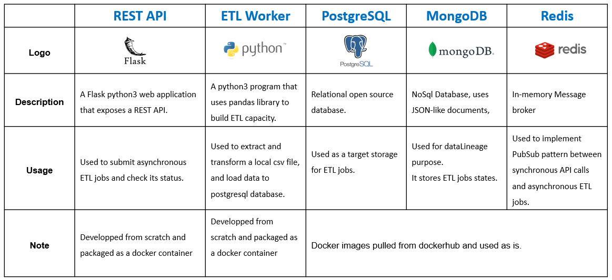

:fontawesome-brands-github: Check out code source on [Github](https://github.com/Oussama-bch/awesome-etl)
## About The Project
This project implements an `awesome-etl`  using modern loosely coupled ``microservice`` architecture.
It enables a ``synchonous`` REST API and long running ``asynchronous`` ETL job through a ``PubSub`` pattern.
<figure markdown>
  
</figure>

## Components
<figure markdown>
  
</figure>

## Sequence diagram

1. Prepare and save the csv file in the local disk : /volume/etl-volume/[FILE TO LOAD.csv]
2. Submit an ETL job through a POST HTTP call to REST API (Get the jobId as a callback)
3. ETL job starts asynchronously after receiving a message from the broker.
4. Check job status through a GET HTTP call to REST API.

<figure markdown>
  { align=center }
</figure>

## MongoDB Data Model
<figure markdown>
  { align=center }
</figure>

## Prerequisits
* `centos-7` Linux environment
* `docker` and `docker-compose`
* ``Python3`` and ``virtualenv``

## Getting Started

1. Install the latest version of Docker and Docker-compose

``` bash
# docker
sudo yum install docker-ce docker-ce-cli containerd.io
sudo systemctl start docker
sudo docker version

# docker-compose
sudo curl -L \
    "https://github.com/docker/compose/releases/download/1.29.2/docker-compose-$(uname -s)-$(uname -m)" \
    -o /usr/local/bin/docker-compose
sudo chmod +x /usr/local/bin/docker-compose
sudo docker-compose --version
```
2. Install Python 3.6.8
```
yum install gcc openssl-devel bzip2-devel libffi-devel

cd /usr/src
wget https://www.python.org/ftp/python/3.6.8/Python-3.6.8.tgz

tar xzf Python-3.6.8.tgz

cd Python-3.6.8
./configure --enable-optimizations
make altinstall

rm /usr/src/Python-3.6.8.tgz

python3 -V
```
3. Install virtualenv
```
python3 -m pip install --user --upgrade pip
python3 -m pip install --user virtualenv
```

4. Create folders to be used later as docker volume mount points
```
mkdir -p volumes/postgres-volume volumes/redis-volume volumes/mongo-volume 
```
5. Fill database config file for api
You must fill [database.ini](https://github.com/Oussama-bch/awesome-etl/blob/master/api/database.ini) with resources created above.
```
[mongodb]
uri=mongodb://[YOUR MACHINE IPv4]:2717
database=etl
collection=jobs

[redis]
host=[YOUR MACHINE IPv4]
port=6379
db=0
channel=etl_jobs
```
6. Fill database config file for worker
You must fill [database.ini](https://github.com/Oussama-bch/awesome-etl/blob/master/worker/database.ini) with resources created above.
```
[mongodb]
uri=mongodb://[YOUR MACHINE IPv4]:2717
database=etl
collection=jobs

[redis]
host=[YOUR MACHINE IPv4]
port=6379
db=0
channel=etl_jobs

[mongodb]
uri=mongodb://[YOUR MACHINE IPv4]:2717
database=etl
collection=jobs

[redis]
host=[YOUR MACHINE IPv4]
port=6379
db=0
channel=etl_jobs

[postgres]
host=[YOUR MACHINE IPv4]
port=5432
database=postgres
username=cf-lab
password=cf-lab
table=global_power_plant
```

## Deployment
All components are deployed as microservices inside dockers container and managed by docker-compose through [yaml](https://github.com/Oussama-bch/awesome-etl/blob/master/docker-compose.yaml) file.
<figure markdown>
  { align=center }
</figure>

1. Start docker-compose service
```
docker-compose up -d
```
2. Create Database, user and table
This instruction can be done using [psql cli](https://docs.postgresql.fr/10/app-psql.html) or [pgAdmin](https://www.pgadmin.org/)
Connect to up and runnig Postgresql database and execute those instructions :
```
-- create database and user
CREATE DATABASE [DATABASE_NAME];
CREATE USER [USERNAME] WITH PASSWORD '[PASSWORD]';
GRANT CONNECT ON DATABASE [DATABASE_NAME] TO [USERNAME];
GRANT USAGE ON SCHEMA public TO [USERNAME];
GRANT all privileges on all tables in schema public TO [USERNAME];

-- create table
DROP TABLE IF EXISTS global_power_plant;

CREATE TABLE global_power_plant (
country VARCHAR,
country_long VARCHAR,
name VARCHAR,
gppd_idnr VARCHAR,
capacity_mw FLOAT8,
latitude FLOAT8,
longitude FLOAT8,
primary_fuel VARCHAR,
other_fuel1 VARCHAR,
other_fuel2 VARCHAR,
other_fuel3 VARCHAR,
commissioning_year INT,
owner TEXT,
source VARCHAR,
url VARCHAR,
geolocation_source VARCHAR,
wepp_id VARCHAR,
year_of_capacity_data INT,
generation_gwh_2013 FLOAT8,
generation_gwh_2014 FLOAT8,
generation_gwh_2015 FLOAT8,
generation_gwh_2016 FLOAT8,
generation_gwh_2017 FLOAT8,
generation_gwh_2018 FLOAT8,
generation_gwh_2019 FLOAT8,
generation_data_source VARCHAR,
estimated_generation_gwh_2013 FLOAT8,
estimated_generation_gwh_2014 FLOAT8,
estimated_generation_gwh_2015 FLOAT8,
estimated_generation_gwh_2016 FLOAT8,
estimated_generation_gwh_2017 FLOAT8,
estimated_generation_note_2013 VARCHAR,
estimated_generation_note_2014 VARCHAR,
estimated_generation_note_2015 VARCHAR,
estimated_generation_note_2016 VARCHAR,
estimated_generation_note_2017 VARCHAR,
job_date DATE,
job_id VARCHAR,
file_name VARCHAR
);
```

## Built With
The project is developed with :
* [Python3](https://www.python.org/downloads/) - Programming language
* [Flask](https://flask.palletsprojects.com/en/2.0.x/) - Web Framework
* [Pandas](https://pandas.pydata.org/) - Data Manipulation Library
* [Docker](https://docs.docker.com/engine/install/) - Container runtime
* [Docker-Compose](https://docs.docker.com/compose/) - Docker container orchestrator
* [PostgreSQL](https://www.postgresql.org/) - SQL Database
* [MongoDB](https://www.mongodb.com/) - NoSQL JSON like document Database
* [Redis](https://redis.io/) - In-memory message broker

## Project content 
* [API](https://github.com/Oussama-bch/awesome-etl/blob/master/api/README.md) - REST API code `Python3 and Flask dependencies`
* [WORKER](https://github.com/Oussama-bch/awesome-etl/blob/master/worker/README.md) - ETL worker code `Python3 and Pandas dependencies`
* [SWAGGER](https://github.com/Oussama-bch/awesome-etl/blob/master/swagger/README.md ) - API description `Swagger standard`.

## Out of scope

* Security - Authentication and Authorization
* High availability
* Scalability

## Authors

* **Oussama BEN CHARRADA** - *Initial work*