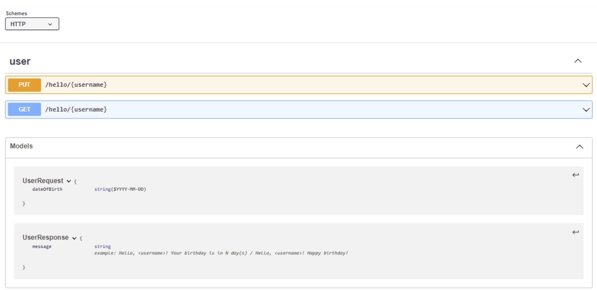

Those instructions will guide you to test the deployed API using Swagger Editor.
{ align=center }

## Test Application using Swagger Editor

* Copy and paste the [PUBLIC_DNS] into [api-swagger.yaml](https://github.com/Oussama-bch/hello-world/blob/main/swagger/api-swagger.yaml) line 6.
* Copy and paste the [api-swagger.yaml](https://github.com/Oussama-bch/hello-world/blob/main/swagger/api-swagger.yaml) content into [swagger-editor](https://editor.swagger.io/#)
* Test API calls using the swagger UI

## Authors

* **Oussama BEN CHARRADA** - *Initial work*