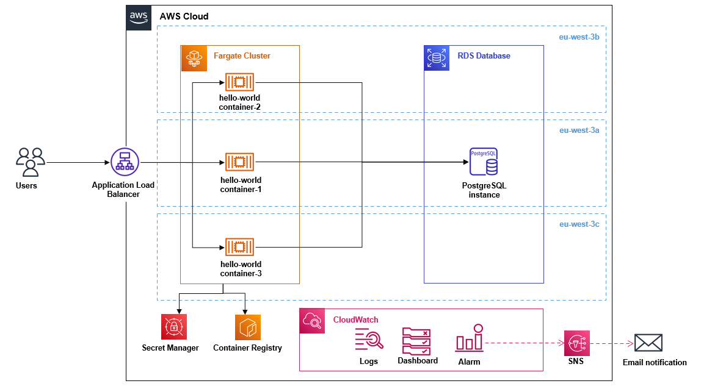

Those instructions will deploy the `REST API` python3 project into [AWS](https://docs.aws.amazon.com/) according to the following architecture :

{ align=center }

A highly available and cost effective `REST API` application deployed using those services :

* **Compute** : AWS ECS [FARGATE]
* **Database** : AWS RDS [POSTGRES]
* **Load Balancing** : AWS ELB [Application Load Balancer]
* **Container Registry** : AWS ECR
* **Credential Management** : AWS Secret Manager
* **Logging** : AWS CloudWatch Logs
* **Monitoring** :  AWS CloudWatch Dashboard, Metrics
* **Alerting** : AWS CloudWatch Alarm, AWS SNS [EMAIL]
    

### Prerequisites

Before statring, you must install all dependencies below inside a ***centos-7*** Linux environment

##### 1- Install Terraform v1.0.6
```
TERRAFORM_VERSION=1.0.6

sudo curl -o /tmp/terraform_${TERRAFORM_VERSION}_linux_amd64.zip https://releases.hashicorp.com/terraform/${TERRAFORM_VERSION}/terraform_${TERRAFORM_VERSION}_linux_amd64.zip
sudo unzip /tmp/terraform_${TERRAFORM_VERSION}_linux_amd64.zip -d /tmp

echo Moving terraform binary to /usr/local/bin/
sudo mv /tmp/terraform /usr/local/bin/
sudo /usr/local/bin/terraform --install-autocomplete > /dev/null 2>&1 || echo autocomplete already installed
```

##### 2- Create AWS Account
Follow those two steps to create new account, grant permission to new user and download AWS Access key/AWS Secret Access key:
* [Create aws account](https://aws.amazon.com/premiumsupport/knowledge-center/create-and-activate-aws-account/)
* [Create aws user and access key pair](https://aws.amazon.com/premiumsupport/knowledge-center/create-access-key/)

##### 3- Install AWS CLI
```
curl "https://awscli.amazonaws.com/awscli-exe-linux-x86_64.zip" -o "awscliv2.zip"
unzip awscliv2.zip
sudo ./aws/install
```

##### 4- Configure AWS CLI

```
aws configure 
AWS Access Key ID [****************Z47Z]:
AWS Secret Access Key [****************Bstj]:
Default region name [eu-west-3]:
Default output format [JSON]:
```

### Deploy Application to AWS

##### 1- Fill terraform.tfvars file
```
s3_name_prefix      = "hello-world"
rds_username        = "USERNAME"
rds_password        = "PASSWORD"
email               ="youremail@mail.com"
```

##### 2- Initiate terraform state file
```
terraform init
```

##### 3- Create Elastic Container Registry
This registry is user to store `REST API` docker image built earlier
```
terraform apply --target=aws_ecr_repository.hello_world
# Type yes
# OUTPUT : [REGISTRY_URL] 
```
##### 4- Tag and push docker container into the registry
```
docker tag hello-world:v0.1 [REGISTRY_URL]:latest
docker push [REGISTRY_URL]:latest
```

##### 5- Deploy the hole application
```
terraform apply
# Type yes
```

### Acceptance tests
Acceptance tests must be executed on the running application on AWS

##### 1- Create the database table
This instruction must be done using [pgAdmin](https://www.pgadmin.org/).
Grab the RDS endpoint : [RDS_ENDPOINT], then connect to the database.
```
-- create table
DROP TABLE IF EXISTS users;

CREATE TABLE users (
	user_id serial PRIMARY KEY,
	username VARCHAR UNIQUE,
	date_of_birth DATE NOT NULL
);
```

##### 2- Tests endpoints
Grab the public DNS of the created Application Load Balancer : [PUBLIC_DNS]
```
# Test PUT request:
curl -X PUT -H "Content-Type: application/json" \
    -d '{"dateOfBirth":"2012-12-31"}' \ 
    http://[PUBLIC_DNS]:80/hello/jhon

# Test GET request :
curl -X 'GET' \
  'http://[PUBLIC_DNS]/hello/jhon' \
  -H 'accept: application/json'
```

## Authors

* **Oussama BEN CHARRADA** - *Initial work*