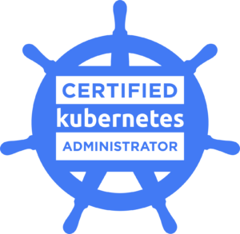

## **Course description**

This training is intended for experts wishing to implement and master production Kubernetes clusters , as well as anyone wishing to understand how Kubernetes is architected, installed and maintained. The deployment of applications on Kubernetes is mentioned superficially, and this training is intended more for people wishing to set up secure, high-performance and highly available Kubernetes clusters than for engineers who need to deploy applications.

During our training sessions, you will discover how to do it thanks to an expert:

- Automated setup and rebuild of multi-node Kubernetes clusters for development and production
- Semi-automated and hot update of Kubernetes clusters
- Advanced storage management techniques , description of storage classes and dynamic volume provisioning
- Management of users and associated rights ( RBAC )
- Presentation of the different network plugins and associated functionalities 
- Delegation to users (DevOps and developers) of network filtering implementation functionalities ( NetworkPolicies )
- Techniques for developing secure containers running with restricted rights, or compatible with automated rights restriction on production cluster ( PodSecurityPolicies )

This training provides a solid foundation for passing the [CKS](https://www.cncf.io/certification/cks/) and [CKA](https://www.cncf.io/certification/cka/) certifications.

<!-- { align=center } -->
{ align=left }
{ align=center }

## **Goals**
* [x] Understand how to use Kubernetes
* [x] Discover the internal architecture of Kubernetes
* [x] Understand the main advanced components of Kubernetes
* [x] Know how to install Kubernetes in production
* [x] Set up authentication and user management
* [x] Master the operation of Kubernetes virtual networks
* [x] Optimize Kubernetes cluster monitoring
* [x] Extend and customize the workings of Kubernetes

## **Targeted audience**
Developers, Architects, System Administrators, DevOps

 
## **Prerequisites**
- Have completed our [Kubernetes Getting Started Training](../k8s-getting-started/)
- Basic knowledge of a Unix/Linux system and how containers work

## **Course outline**

### Kubernetes administration in production
- Advanced kubeadm configuration
- Automated setup of a Kubernetes On-Premise cluster
- Securing a Kubernetes On-Premise cluster for production
- Implementation of high availability for the Control-Plane
- Continuous Cloud Integration with kind
- CRI: crictl, Docker and Containerd

### Kubernetes architecture
- Components of the Control Plane and the Data Plane:
- How the Kubernetes Reconciliation Loop and Controller Works
- How etcd works in high-availability mode
- Internal workings of the API server: Authentication, Authorization and Admission Control
- Extending the API Server Lifecycle with MutatingAdmissionWebhooks and ValidatingAdmissionWebhooks
- Description of the Kubernetes Scheduler algorithm, predicates and priorities
- Declarative configuration
- Implicit or dynamic grouping
- API-driven interactions
- Kube-proxy: Advanced Services Virtual Network Operation
- Service discovery with CoreDNS

### User  management access rights
- Authentication: certificates and tokens
- Setting up the Kubeconfig file with Configuration Contexts
- Service Account Management
- Securing cluster steering with RBAC permissions
- Role, ClusterRol and RoleBinding / ClusterRoleBinding
- Creation of simple and generic RBAC to drive a production cluster

### Security
- Securing the execution of Unix processes in Pods
- SecurityContext: Privileged mode, Linux Capabilities, securing Unix processes
- Industrialize Pod Security with PodSecurityPolicies
- Choosing a Secure and High-Performance CNI Network Plugin
- Industrialize network security (L4) with NetworkPolicies (ingress and egress)

###  Service quality
- Optimal use of hardware resources thanks to Requests and Limits
- QoS classes: Guaranteed, Burstable and BestEffort
- Resource Allocation Control by Namespace with ResourceQuota
- Resource allocation control per Pod with LimitRange

### Scheduler optimizaion
- Planning control with Labels and Affinities
- NodeSelector, NodeAffinity, PodAffinity, PodAntiAffinity
- Taints and Tolerations

### Monitoring
- Monitoring and Logging Purposes
- Automate monitoring with the Prometheus and Grafana
- Get and aggregate your cluster and application metrics
- AlertManager: alert management and routing